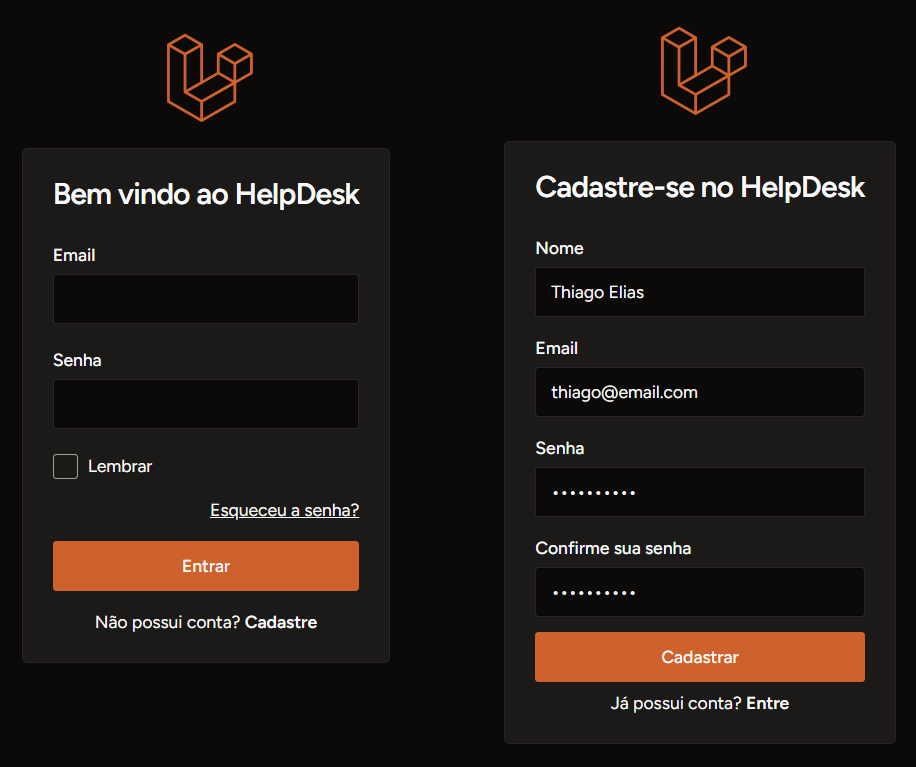
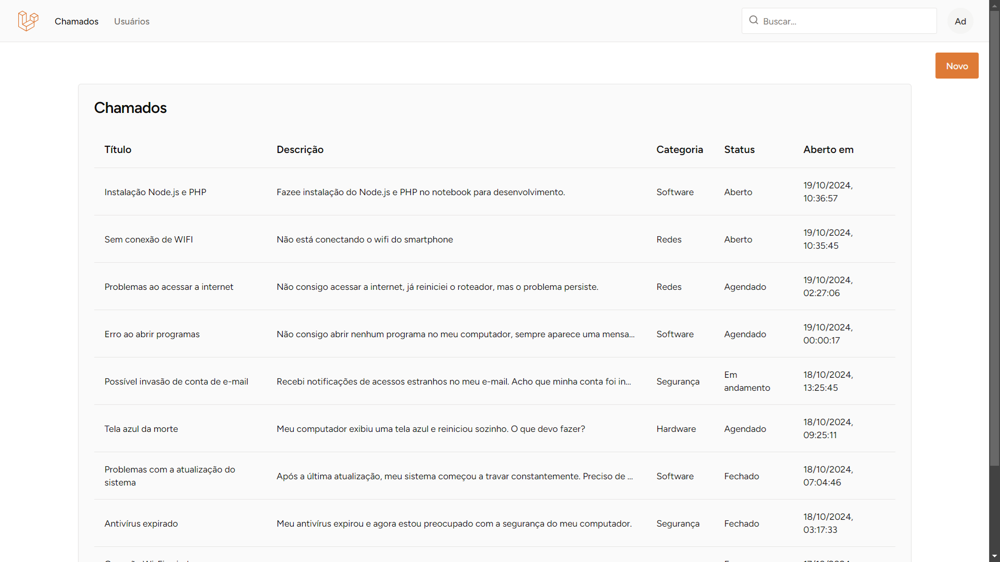
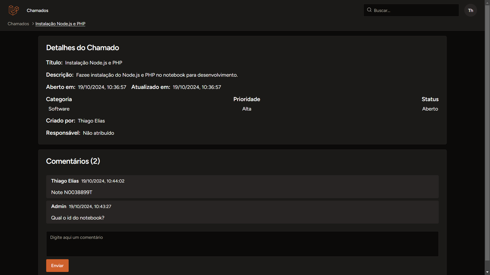
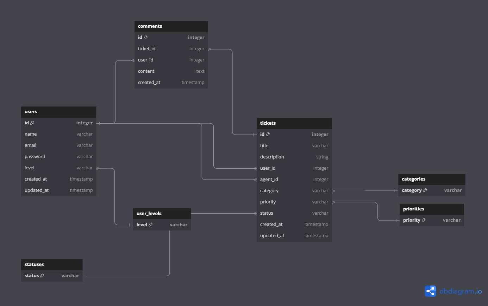

<h1 align="center">Sistema Helpdesk</h1> 

Conjunto de aplicações fullstack desenvolvida para aprimoração de conhecimentos. Simula um sistema de atendimento e suporte popularmente chamado de HelpDesk. O objetivo principal do projeto é a prática do uso do Framework Laravel com integração a outras aplicações e sistemas.

### **Aplicações**
- **Fullstack** - [Link](https://github.com/thiagoelias99/helpdesk/tree/main/helpdesk) - Uma aplicação fullstack monolítica no padrão **MVC** criada com **Laravel/php** como controllador, **Inertia/React** como templates e banco de dados **mySql**.

### **Imagens**

### **Modelagem**
- **Usuário**: A pessoa que cria os chamados.
- **Agente de Suporte**: A pessoa responsável por atender e resolver os chamados.
- **Administrador**: A pessoa que consegue alterar as permissões da aplicação.
- **Chamado (Ticket)**: O problema ou solicitação criado por um usuário que precisa ser resolvido.
- **Categoria**: Classificação do chamado (ex: TI, Recursos Humanos, Infraestrutura, etc.).
- **Prioridade**: Indica o nível de urgência do chamado (ex: baixa, média, alta, crítica).
- **Status**: O estado do chamado (ex: Aberto, Em Progresso, Resolvido).
- **Comentários**: Mensagens entre usuário e agente de suporte dentro de um chamado.

### **Funcionalidades || Cases**
- **Cadastro de Usuário**: Os usuários devem poder se registrar e criar uma conta no sistema.
- **Criação de Chamados**: Um usuário pode criar um chamado informando um título, descrição, categoria e prioridade.
- **Visualização de chamados**: Um usuário só pode ter acessos aos seus chamados. Agente e administrador podem ter acesso a qualquer chamado.
- **Atribuição de Chamados**: O sistema deve permitir que chamados sejam atribuídos somente a agentes de suporte.
- **Atualização de Status**: Os agentes devem poder alterar o status do chamado ao longo do processo de resolução.
- **Histórico de Chamados**: Tanto os usuários quanto os agentes devem poder visualizar o histórico de chamados criados/resolvidos.
- **Comentários**: Usuários e agentes podem adicionar comentários aos chamados para troca de informações.
- **Permissões**: Somente um administrador pode alterar as permissões da aplicação.
- **Conta**: Qualquer usuário pode excluir todos os seus dados pessoais do sistema.
